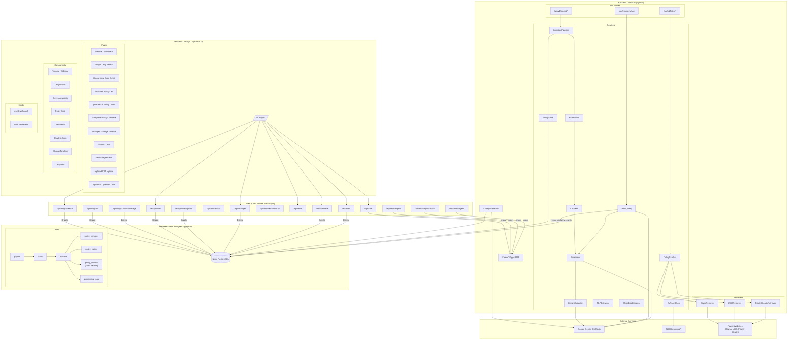

# Architecture Flow

```mermaid
graph TB
    subgraph "Frontend - Next.js 16 (React 19)"
        UI[/"UI Pages"/]

        subgraph Pages
            HOME["/  Home Dashboard"]
            DRUGS["/drugs  Drug Search"]
            DRUG_DETAIL["/drugs/:rxcui  Drug Detail"]
            POLICIES["/policies  Policy List"]
            POLICY_DETAIL["/policies/:id  Policy Detail"]
            COMPARE["/compare  Policy Compare"]
            CHANGES["/changes  Change Timeline"]
            CHAT["/chat  AI Chat"]
            FETCH["/fetch  Payer Fetch"]
            UPLOAD["/upload  PDF Upload"]
            APIDOCS["/api-docs  OpenAPI Docs"]
        end

        subgraph Components
            TOPNAV[TopNav / Sidebar]
            DRUGSEARCH[DrugSearch]
            COVERAGEMATRIX[CoverageMatrix]
            POLICYCARD[PolicyCard]
            CLAIMDETAIL[ClaimDetail]
            CHATUI[ChatInterface]
            TIMELINE[ChangeTimeline]
            DROPZONE[Dropzone]
        end

        subgraph Hooks
            USE_DRUG[useDrugSearch]
            USE_COMP[useComparison]
        end
    end

    subgraph "Next.js API Routes (BFF Layer)"
        API_CHAT["/api/chat"]
        API_DRUGS_SEARCH["/api/drugs/search"]
        API_DRUGS_ALL["/api/drugs/all"]
        API_DRUGS_COV["/api/drugs/:rxcui/coverage"]
        API_POLICIES["/api/policies"]
        API_POLICY_ID["/api/policies/:id"]
        API_POLICY_UPLOAD["/api/policies/upload"]
        API_POLICY_STATUS["/api/policies/status/:id"]
        API_FETCH["/api/fetch"]
        API_FETCH_PAYERS["/api/fetch/payers"]
        API_FETCH_INGEST["/api/fetch/ingest"]
        API_FETCH_BATCH["/api/fetch/ingest-batch"]
        API_CHANGES["/api/changes"]
        API_COMPARE["/api/compare"]
        API_STATS["/api/stats"]
    end

    subgraph "Backend - FastAPI (Python)"
        FASTAPI_APP["FastAPI App :8000"]

        subgraph "API Routes"
            INGEST_R["/api/v1/ingest/*"]
            QUERY_R["/api/v1/query/ask"]
            FETCH_R["/api/v1/fetch/*"]
        end

        subgraph Services
            PDF_PARSER[PDFParser]
            CHUNKER[Chunker]
            EMBEDDER[Embedder]
            GEMINI_EXT[GeminiExtractor]
            NLP_EXT[NLPExtractor]
            MEGA_EXT[MegaDocExtractor]
            PIPELINE[IngestionPipeline]
            RAG[RAGQuery]
            RXNORM_SVC[RxNormClient]
            POLICY_FETCHER[PolicyFetcher]
            POLICY_STORE[PolicyStore]
        end

        subgraph Retrievers
            CIGNA[CignaRetriever]
            UHC[UHCRetriever]
            PRIORITY[PriorityHealthRetriever]
        end

        CHANGE_DET[ChangeDetector]
    end

    subgraph "External Services"
        GEMINI["Google Gemini 2.5 Flash"]
        RXNORM_API["NIH RxNorm API"]
        PAYER_SITES["Payer Websites<br/>(Cigna, UHC, Priority Health)"]
    end

    subgraph "Database - Neon Postgres + pgvector"
        DB[(Neon PostgreSQL)]

        subgraph Tables
            T_PAYERS[payers]
            T_PLANS[plans]
            T_POLICIES[policies]
            T_VERSIONS[policy_versions]
            T_CLAIMS[policy_claims]
            T_CHUNKS["policy_chunks<br/>(768d vectors)"]
            T_JOBS[processing_jobs]
        end
    end

    %% Frontend -> BFF
    UI --> API_CHAT & API_DRUGS_SEARCH & API_POLICIES & API_FETCH & API_COMPARE & API_CHANGES & API_STATS

    %% BFF -> FastAPI
    API_CHAT -->|proxy| FASTAPI_APP
    API_FETCH_INGEST -->|proxy| FASTAPI_APP
    API_FETCH_BATCH -->|proxy| FASTAPI_APP
    API_FETCH_PAYERS -->|proxy| FASTAPI_APP

    %% BFF -> DB (Drizzle ORM)
    API_DRUGS_SEARCH -->|Drizzle| DB
    API_DRUGS_ALL -->|Drizzle| DB
    API_DRUGS_COV -->|Drizzle| DB
    API_POLICIES -->|Drizzle| DB
    API_POLICY_UPLOAD -->|Drizzle| DB
    API_CHANGES -->|Drizzle| DB
    API_COMPARE -->|Drizzle| DB
    API_STATS -->|Drizzle| DB

    %% FastAPI internals
    INGEST_R --> PIPELINE
    PIPELINE --> PDF_PARSER --> CHUNKER --> EMBEDDER --> GEMINI_EXT
    PIPELINE --> POLICY_STORE
    QUERY_R --> RAG
    RAG --> EMBEDDER
    FETCH_R --> POLICY_FETCHER
    POLICY_FETCHER --> CIGNA & UHC & PRIORITY
    CHANGE_DET --> GEMINI

    %% External
    GEMINI_EXT --> GEMINI
    RAG --> GEMINI
    EMBEDDER --> GEMINI
    RXNORM_SVC --> RXNORM_API
    CIGNA & UHC & PRIORITY --> PAYER_SITES

    %% FastAPI -> DB
    POLICY_STORE --> DB
    RAG -->|"vector similarity search"| DB
    CHANGE_DET --> DB

    %% Table relationships
    T_PAYERS --> T_PLANS --> T_POLICIES
    T_POLICIES --> T_VERSIONS & T_CLAIMS & T_CHUNKS & T_JOBS
```
