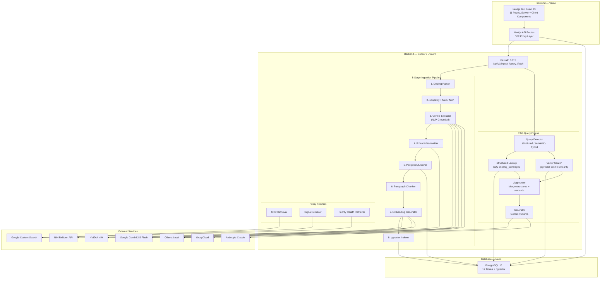
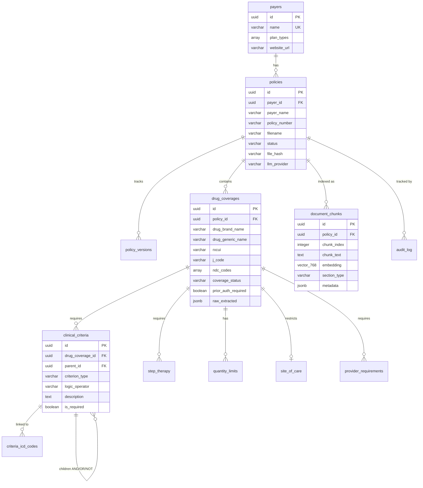
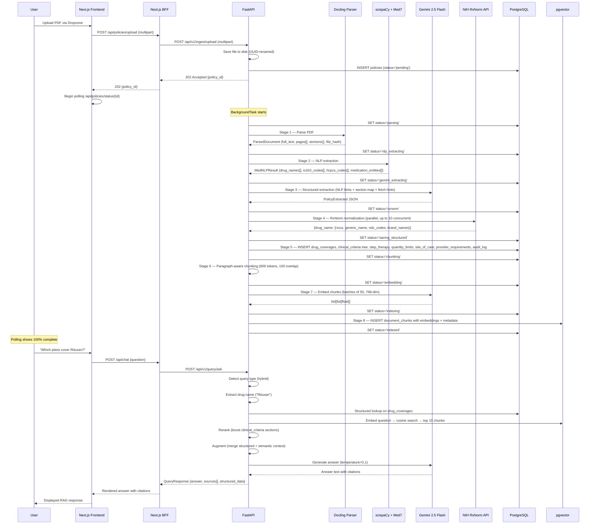
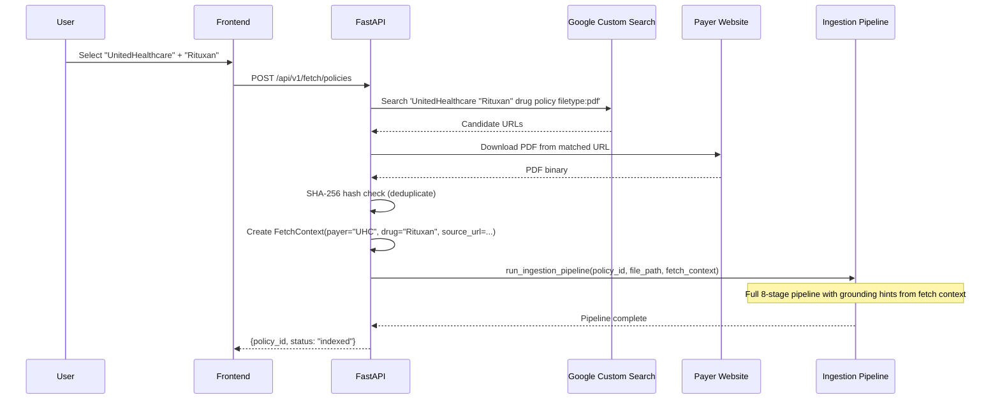
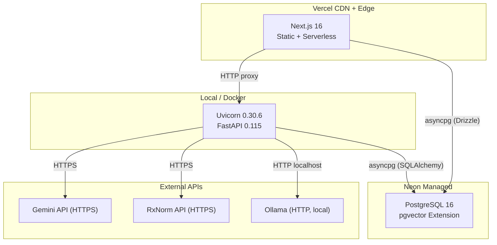
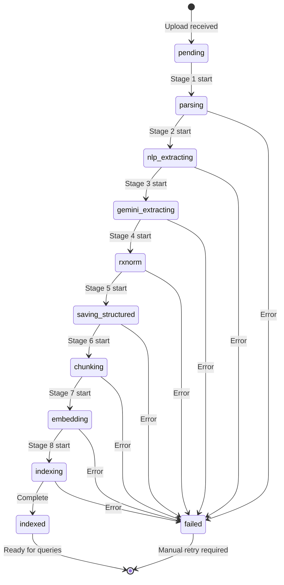

# InsightRX — Internal Technical Architecture Document

---

**Project:** InsightRX — AI-Powered Medical Benefit Drug Policy Intelligence
**Authors:** Abhinav, Neeharika, Adi (Team: The Formulators)
**Version:** 0.2.0
**Date:** April 7, 2026
**Classification:** Internal Technical Architecture Document — Restricted
**Event:** Innovation Hacks 2.0, Arizona State University

---

## License

This work is licensed under the **Creative Commons Attribution-NonCommercial-ShareAlike 4.0 International (CC BY-NC-SA 4.0)** license.

You are free to:

- **Share** — copy and redistribute the material in any medium or format
- **Adapt** — remix, transform, and build upon the material

Under the following terms:

- **Attribution** — You must give appropriate credit, provide a link to the license, and indicate if changes were made.
- **NonCommercial** — You may not use the material for commercial purposes.
- **ShareAlike** — If you remix, transform, or build upon the material, you must distribute your contributions under the same license as the original.

Full license text: https://creativecommons.org/licenses/by-nc-sa/4.0/legalcode

**For commercial licensing inquiries:** chatgpt@asu.edu

**Suggested citation:** InsightRX Architecture Specification v0.2.0, Abhinav, Neeharika, Adi. April 2026. Innovation Hacks 2.0, ASU.

**License:** CC BY-NC-SA 4.0. Commercial inquiries: chatgpt@asu.edu

---

## Table of Contents

1. [Executive Technical Summary](#1-executive-technical-summary)
2. [Scope and Objectives](#2-scope-and-objectives)
3. [System Overview](#3-system-overview)
4. [Architecture Principles](#4-architecture-principles)
5. [High-Level Architecture Diagram](#5-high-level-architecture-diagram)
6. [Component-by-Component Breakdown](#6-component-by-component-breakdown)
7. [End-to-End Data Flow](#7-end-to-end-data-flow)
8. [Data Model and Storage Architecture](#8-data-model-and-storage-architecture)
9. [API Architecture](#9-api-architecture)
10. [Processing / Pipeline Internals](#10-processing--pipeline-internals)
11. [AI / ML / LLM Design](#11-ai--ml--llm-design)
12. [Security, Privacy, and Compliance Considerations](#12-security-privacy-and-compliance-considerations)
13. [Reliability and Failure Handling](#13-reliability-and-failure-handling)
14. [Performance and Scalability](#14-performance-and-scalability)
15. [Deployment Architecture](#15-deployment-architecture)
16. [Observability and Operations](#16-observability-and-operations)
17. [Reproducibility in Principle](#17-reproducibility-in-principle)
18. [Design Tradeoffs and Alternatives Considered](#18-design-tradeoffs-and-alternatives-considered)
19. [Risks and Open Questions](#19-risks-and-open-questions)
20. [Future Improvements](#20-future-improvements)
21. [Appendix](#21-appendix)

---

## 1. Executive Technical Summary

InsightRX is a dual-stack policy intelligence platform that transforms unstructured health insurance medical benefit drug policy PDFs into structured, searchable, comparable data — and exposes that data through a hybrid RAG (Retrieval-Augmented Generation) query engine.

**Core technical purpose:** Automate the extraction, normalization, and cross-payer comparison of drug coverage rules from payer PDFs that are currently read manually by healthcare operations teams.

**Architecture style:** Backend-for-Frontend (BFF) pattern with a Next.js 16 frontend proxying to a FastAPI Python backend. The backend owns all AI/NLP logic, document processing, and database writes. The frontend handles presentation, client-side interactivity, and read-path queries.

**Primary technologies:**

| Layer | Technology |
|-------|-----------|
| Frontend | Next.js 16, React 19, TypeScript 5.7, Tailwind CSS 4, shadcn/ui |
| Backend | FastAPI 0.115, SQLAlchemy 2.0 (async), Pydantic 2.9, Uvicorn |
| Database | PostgreSQL 16 (Neon) with pgvector extension (768-dim IVFFlat) |
| Document Parsing | Docling (IBM) with pypdf fallback |
| Biomedical NLP | scispaCy, Med7, regex-based code extraction |
| LLM Extraction | Google Gemini 2.5 Flash (primary), Ollama, Groq, NVIDIA NIM, Anthropic Claude |
| Drug Normalization | NIH RxNorm API (RxCUI, NDC, brand/generic resolution) |
| Embeddings | Gemini text-embedding-005 (768-dim), Ollama nomic-embed-text, NVIDIA nv-embedqa-e5-v5 |
| Deployment | Vercel (frontend), Docker Compose (backend), Neon (managed Postgres) |

**High-level pipeline summary:**

1. Ingest a payer PDF (upload or auto-fetch from payer website)
2. Parse with Docling (97.9% table accuracy)
3. Run biomedical NLP extraction (drug names, ICD-10, HCPCS J-codes)
4. Feed NLP-grounded hints to Gemini for structured JSON extraction
5. Normalize drug identities via NIH RxNorm API (RxCUI canonical IDs)
6. Persist structured coverage data to 12 PostgreSQL tables
7. Chunk document text with paragraph-aware sliding window
8. Generate 768-dimensional embeddings and index in pgvector
9. Serve hybrid RAG queries (structured SQL + vector similarity) with cited answers

**Key differentiators:**

- **NLP-grounded LLM extraction** eliminates hallucination by confirming rather than inventing medical codes
- **Tree-structured clinical criteria model** with AND/OR/NOT logic preserves the full complexity of payer requirements
- **Cross-payer drug comparison** normalizes across brand names, generics, RxCUI, HCPCS J-codes, and NDC codes
- **Semantic change detection** classifies policy updates by clinical significance (breaking/material/minor/cosmetic)
- **Multi-provider LLM abstraction** allows runtime switching between 5 providers without code changes

---

## 2. Scope and Objectives

### 2.1 Problems Solved

Medical benefit drug policies are published by health insurers (payers) as dense, 10–200+ page PDF documents. Healthcare teams — pharmacy, medical affairs, market access — currently:

1. Manually read each PDF to determine if a specific drug is covered
2. Cross-reference multiple payer documents to compare coverage rules
3. Track policy version changes by re-reading updated documents
4. Answer ad-hoc coverage questions by searching through archived PDFs

This process takes hours per drug per payer and is error-prone due to the complexity of prior authorization criteria, step therapy requirements, quantity limits, and ICD-10 diagnosis codes embedded in unstructured text.

### 2.2 Functional Goals

- **F1:** Parse payer PDFs into structured drug coverage records with full clinical criteria
- **F2:** Normalize drug identities across payer-specific naming to canonical RxCUI identifiers
- **F3:** Enable cross-payer side-by-side comparison of coverage status, prior auth, step therapy, and quantity limits
- **F4:** Answer natural-language policy questions with grounded, cited RAG responses
- **F5:** Automatically fetch policy documents from supported payer websites
- **F6:** Detect and classify changes between policy versions by clinical significance

### 2.3 Non-Functional Goals

- **NFR1:** End-to-end ingestion of a typical 20-page policy in under 5 minutes
- **NFR2:** Sub-2-second response time for structured drug comparison queries
- **NFR3:** Multi-provider LLM support to avoid vendor lock-in and manage API costs
- **NFR4:** Graceful degradation when any single external service is unavailable
- **NFR5:** Immutable audit trail for all policy changes (with future blockchain anchoring readiness)

### 2.4 Explicitly Out of Scope

- Pharmacy benefit formulary parsing (medical benefit drugs only)
- Patient-facing eligibility checking or claims adjudication
- EHR/EMR integration or FHIR resource generation (future roadmap)
- Real-time payer API integration (payer APIs do not exist for this data)
- Multi-tenant role-based access control (single-tenant for hackathon)
- HIPAA compliance infrastructure (no PHI is processed — only public policy documents)

---

## 3. System Overview

### 3.1 End-to-End System Description

InsightRX operates as two independently deployable services — a Next.js frontend and a FastAPI backend — sharing a PostgreSQL database with pgvector.

**Users interact with the system through seven primary workflows:**

1. **Dashboard** — View live statistics (drug count, policy count, payer count), recent policy changes, and a quick Q&A embed
2. **Upload** — Submit a payer PDF, select an LLM provider, and watch the 8-stage pipeline progress in real time
3. **Auto-Fetch** — Select a payer and drug name; the system scrapes the payer's website, downloads the relevant PDF, and auto-ingests it
4. **Drug Search** — Search by brand name, generic name, or HCPCS J-code; results show which payers cover the drug and with what requirements
5. **Compare** — Select a drug and view a side-by-side coverage matrix across all indexed payers
6. **Chat (RAG Q&A)** — Ask natural-language questions about indexed policies and receive cited answers
7. **Changes** — View a timeline of policy version changes classified by significance

### 3.2 Major Components

| Component | Responsibility | Runtime |
|-----------|---------------|---------|
| Next.js Frontend | UI rendering, routing, theme, client-side data fetching | Vercel / Node.js |
| Next.js BFF API Routes | Proxy layer, data aggregation, drug deduplication | Vercel serverless |
| FastAPI Backend | Ingestion pipeline, RAG query engine, policy fetching | Uvicorn / Docker |
| PostgreSQL + pgvector | Structured storage, vector similarity search | Neon managed |
| External LLM Providers | Text generation, structured extraction | Cloud API |
| NIH RxNorm API | Drug identity normalization | Public API |
| Payer Websites | Source documents for auto-fetch | Public web |

---

## 4. Architecture Principles

### 4.1 Why This Architecture

The dual-stack (Next.js + FastAPI) design was chosen because:

1. **Python owns AI/NLP logic:** Docling, scispaCy, Med7, and the Google GenAI SDK are Python-native. Attempting to run these in Node.js would require FFI bridges or WASM compilation, adding fragility without benefit.
2. **Next.js owns the UI and read path:** Server components, streaming, and Vercel's edge network provide sub-second page loads. The BFF layer aggregates backend data into frontend-optimized shapes.
3. **Shared database, not shared runtime:** Both stacks read from PostgreSQL, but only FastAPI writes. This eliminates distributed transaction complexity while allowing the frontend to bypass the backend for simple reads.

### 4.2 Design Decisions

| Principle | Implementation |
|-----------|---------------|
| **Separation of concerns** | Frontend never touches AI/NLP. Backend never renders UI. Database is the shared truth. |
| **Graceful degradation** | Every external service call (LLM, RxNorm, embeddings) has fallback logic. Failed embedding chunks receive zero vectors. |
| **NLP-grounded extraction** | LLM extraction receives pre-extracted codes as hints, reducing hallucination to near-zero for medical codes. |
| **Immutable audit trail** | Every policy change creates a `PolicyVersion` and `AuditLog` entry. Records include SHA-256 file hashes with a placeholder for future Solana blockchain anchoring. |
| **Multi-provider abstraction** | LLM provider is a runtime configuration parameter. No code changes needed to switch between Gemini, Ollama, Groq, NVIDIA, or Anthropic. |
| **Async-first backend** | All database operations use SQLAlchemy async with asyncpg. All HTTP calls use httpx async. Background tasks use FastAPI's `BackgroundTask`. |
| **Paragraph-aware chunking** | Text is chunked on paragraph boundaries (not fixed token counts) to preserve semantic units for retrieval. |

### 4.3 Cost/Performance Tradeoffs

| Tradeoff | Decision | Rationale |
|----------|----------|-----------|
| Accuracy vs speed (parsing) | Docling (slower, 97.9% table accuracy) over Marker (faster, lower accuracy) | Medical policy tables contain critical codes; accuracy is non-negotiable |
| Cost vs quality (LLM) | Gemini free tier with rate limiting vs. paid Anthropic | Hackathon budget constraint; production would use paid tier with higher rate limits |
| Single DB vs separate vector store | pgvector in PostgreSQL vs. Pinecone/Weaviate | Eliminates operational complexity of a second database; pgvector performance is sufficient at this scale |
| Sync NLP vs async NLP | Sync (run_in_executor) for scispaCy/Med7 | These libraries are not async-native; thread pool executor provides adequate concurrency |

---

## 5. High-Level Architecture Diagram



---

## 6. Component-by-Component Breakdown

### 6.1 Frontend — Next.js 16

**Purpose:** Render the user interface, handle client-side interactivity, and proxy API requests to the FastAPI backend.

**Technology:** Next.js 16.0.0, React 19.0.0, TypeScript 5.7, Tailwind CSS 4.0, shadcn/ui, Geist + Montserrat + Inter fonts.

**Inputs:** User actions (searches, uploads, navigation), FastAPI responses, direct Postgres reads (via Drizzle ORM).

**Outputs:** Rendered HTML, API proxy calls, client-side state updates.

#### 6.1.1 Routing (App Router)

| Route | Component Type | Description |
|-------|---------------|-------------|
| `/` | Server | Dashboard — stats, recent policies, change timeline, embedded chat |
| `/upload` | Client | PDF/DOCX upload with LLM provider selector and 8-stage progress visualization |
| `/fetch` | Client | Auto-fetch from payer websites with payer/drug selectors |
| `/drugs` | Server | Drug search with filtering by name, generic, J-code |
| `/drugs/[rxcui]` | Client | Drug detail page with cross-payer coverage matrix |
| `/compare` | Client | Side-by-side payer comparison for a selected drug |
| `/policies` | Server | List of all ingested policies with status badges |
| `/policies/[id]` | Server | Policy detail with extracted drug coverage data |
| `/chat` | Client | Full-screen RAG Q&A with message bubbles and citations |
| `/changes` | Server | Policy change timeline with significance classification |
| `/api-docs` | Client | Interactive OpenAPI documentation viewer |

#### 6.1.2 Component Architecture

```
src/components/
├── layout/
│   └── top-nav.tsx          — Global navigation bar with theme toggle
├── chat/
│   ├── chat-interface.tsx   — Full chat UI with suggestion cards, typing animation
│   └── message-bubble.tsx   — User/assistant message rendering with avatars
├── drug/
│   ├── coverage-matrix.tsx  — 7-column grid: Plan, Coverage, PA, Step, Limit, Criteria
│   └── drug-search.tsx      — Card grid with payer avatars and status badges
├── upload/
│   └── dropzone.tsx         — Drag-and-drop file input (PDF, DOCX, HTML, TXT)
├── changes/
│   └── change-timeline.tsx  — Card-based timeline with significance badges
├── policy/
│   └── policy-card.tsx      — Payer name, drug count, status, LLM provider badges
├── ui/                      — shadcn/ui primitives (button, card, input, tabs, dialog, etc.)
└── theme-provider.tsx       — Dark/light mode via CSS class toggle + localStorage
```

**State management:** React hooks only (`useState`, `useEffect`, `useCallback`, `useMemo`). No Redux or Zustand. Custom hooks: `useComparison()`, `useDrugSearch()`, `useToast()`.

**Data fetching pattern:**
- Server components: Direct `fetch()` to FastAPI with `cache: 'no-store'`
- Client components: `fetch()` to Next.js API routes (BFF layer) with `AbortController` for cleanup on unmount

**Styling:** Tailwind CSS 4 with oklch color system. Brand cyan: `#91BFEB`. Dark mode via `.dark` class on `<html>`. Custom `slideUp` animation for toasts.

**Failure cases:** Backend unreachable produces empty states with "No data" messages. Disabled API endpoints return 403 with toast notifications. Failed fetches degrade to empty arrays.

**Why this component exists:** The frontend decouples user experience from backend complexity. Users see a polished dashboard; the backend handles the 8-stage pipeline, NLP, and LLM orchestration invisibly.

**Scaling considerations:** Vercel serverless functions auto-scale horizontally. Static pages are CDN-cached. No frontend state persistence beyond localStorage for theme preference.

**Security implications:** No sensitive data is rendered or cached client-side. API keys are server-side only. CORS is restricted to localhost origins during development.

---

### 6.2 Next.js BFF API Routes

**Purpose:** Proxy frontend requests to FastAPI, aggregate data for frontend-optimized shapes, and handle drug deduplication/normalization on the read path.

**Location:** `src/app/api/`

**Key routes:**

| Route | Method | Backend Target | Logic |
|-------|--------|---------------|-------|
| `/api/stats` | GET | `/api/v1/ingest/stats` | Aggregates drug, policy, payer counts |
| `/api/drugs/search?q=` | GET | `/api/v1/ingest/policies` | Client-side dedup by normalized brand name (lowercase, stripped ®/™) |
| `/api/drugs/all` | GET | `/api/v1/ingest/policies` | Groups drugs by brand, counts plans, tracks payers |
| `/api/drugs/[rxcui]/coverage` | GET | `/api/v1/query/compare/{rxcui}` | Cross-payer coverage matrix for one drug |
| `/api/compare?drug=` | GET | `/api/v1/query/compare/{drug}` | Full comparison matrix |
| `/api/policies` | GET | `/api/v1/ingest/policies` | Policy list with metadata |
| `/api/policies/[id]` | GET | `/api/v1/ingest/policies/{id}` | Policy detail with drug_coverages |
| `/api/policies/upload` | POST | `/api/v1/ingest/upload` | **DISABLED** — returns 403 |
| `/api/policies/status/[id]` | GET | `/api/v1/ingest/status/{id}` | Pipeline progress polling |
| `/api/chat` | POST | `/api/v1/query/ask` | **DISABLED** — returns 403 |
| `/api/changes` | GET | `/api/v1/ingest/changes` | Policy change timeline |
| `/api/fetch/payers` | GET | `/api/v1/fetch/payers` | Available payer adapters |
| `/api/fetch/ingest` | POST | `/api/v1/fetch/policies` | Trigger auto-fetch + ingest |

**Drug deduplication logic (BFF):** The `/api/drugs/search` and `/api/drugs/all` routes aggregate across all indexed policies and deduplicate by normalized brand name (lowercase, stripped of `®` and `™` symbols). Each unique drug entry includes a `planCount` (number of payers covering it) and a `payers` array.

**Why this layer exists:** The BFF pattern keeps the frontend clean of backend URL management, provides a single CORS-safe origin for all API calls, and enables frontend-specific aggregation (drug dedup) without polluting the backend API surface.

---

### 6.3 FastAPI Backend

**Purpose:** Own all AI/NLP logic, document processing, database writes, and the RAG query engine.

**Location:** `backend/`

**Framework:** FastAPI 0.115 with Uvicorn ASGI server.

**Application initialization (`backend/main.py`):**

```python
app = FastAPI(title="InsightRX API", version="0.2.0")
# CORS: localhost:3000, localhost:5173
# Routers: /api/v1/ingest, /api/v1/query, /api/v1/fetch
# Lifespan: init_db() → CREATE EXTENSION IF NOT EXISTS vector
# Health: GET /health → {"status": "ok"}
```

**Router structure:**

| Router | Prefix | Responsibility |
|--------|--------|---------------|
| `ingest.py` | `/api/v1/ingest` | Upload, status polling, policy listing, stats |
| `query.py` | `/api/v1/query` | RAG ask, cross-payer compare |
| `fetch.py` | `/api/v1/fetch` | Auto-fetch from payer websites |

**Concurrency model:** Fully async. Database via SQLAlchemy async + asyncpg. HTTP via httpx async. CPU-bound NLP via `asyncio.to_thread()` (thread pool executor). Background pipeline via FastAPI `BackgroundTask`.

**Error handling:** HTTPException with status codes: 202 (accepted), 404 (not found), 413 (file too large), 415 (unsupported type), 500 (internal), 503 (backend unavailable).

**Logging:** `structlog` with structured key-value logging. Contextual fields: `policy_id`, `drug_name`, `payer`, `error`, `provider`.

**Dependencies (requirements.txt):**

| Package | Version | Purpose |
|---------|---------|---------|
| fastapi | 0.115.0 | Web framework |
| uvicorn[standard] | 0.30.6 | ASGI server |
| sqlalchemy | 2.0.35 | Async ORM |
| asyncpg | 0.29.0 | PostgreSQL async driver |
| pgvector | 0.3.2 | Vector extension bindings |
| docling | >=2.5.0 | Primary PDF parser |
| pypdf | 5.4.0 | Fallback PDF parser |
| google-generativeai | 0.8.3 | Gemini API |
| anthropic | >=0.40.0 | Claude API |
| pydantic | 2.9.2 | Data validation |
| pydantic-settings | 2.5.2 | Configuration |
| tenacity | 9.0.0 | Retry logic |
| httpx | 0.27.2 | Async HTTP client |
| structlog | 24.4.0 | Structured logging |
| beautifulsoup4 | 4.12.3 | HTML parsing for payer scrapers |
| lxml | 5.2.2 | Fast HTML/XML parser backend |
| requests | 2.32.3 | Sync HTTP (non-async helpers) |
| aiofiles | 24.1.0 | Async file operations |

---

### 6.4 Database — PostgreSQL 16 + pgvector

**Purpose:** Store all structured coverage data, document chunks with vector embeddings, and immutable audit history.

**Infrastructure:** Neon managed PostgreSQL (cloud) or local Docker (`pgvector/pgvector:pg16`).

**Schema overview (12 tables):**



**Key design decisions:**

1. **Tree-structured clinical criteria:** The `clinical_criteria` table uses an adjacency list pattern (`parent_id` self-referencing foreign key) with `logic_operator` (AND/OR/NOT) to represent the full complexity of payer requirements. Example: "Patient must have (Diagnosis A OR Diagnosis B) AND (Failed Drug X for 90 days)."

2. **Denormalized `payer_name` on policies:** Avoids a JOIN on every query while maintaining the foreign key to `payers` for referential integrity.

3. **JSONB `raw_extracted` on drug_coverages:** Preserves the complete LLM extraction output for audit and debugging, even though the structured fields capture the normalized version.

4. **`Vector(768)` on document_chunks:** Fixed dimensionality matching Gemini text-embedding-005 and Ollama nomic-embed-text. Index type: IVFFlat with `lists=100`.

5. **`solana_tx_hash` on audit_log:** Placeholder column for future blockchain anchoring of policy change hashes. Currently unused.

**Unique constraints:**
- `payers.name` — one record per payer
- `(payer_id, policy_number, effective_date)` on `policies` — prevents duplicate ingestion of same policy version
- `drug_coverage_id` on `site_of_care` — one-to-one relationship

**Cascade deletes:** All child tables cascade on parent deletion (`ondelete="CASCADE"`).

---

### 6.5 8-Stage Ingestion Pipeline

**Purpose:** Transform a raw PDF into structured, searchable, comparable data. This is the core value proposition of the system.

**Location:** `backend/app/services/ingestion_pipeline.py`

**Execution model:** Runs as a FastAPI `BackgroundTask`. The upload endpoint returns HTTP 202 immediately; the client polls `/api/v1/ingest/status/{policy_id}` for progress.

**Progress tracking:**

| Stage | Status Value | Progress % | Duration (typical 20-page PDF) |
|-------|-------------|------------|-------------------------------|
| 1. Parse | `parsing` | 10% | 5–30s |
| 2. NLP Extract | `nlp_extracting` | 20% | 2–10s |
| 3. LLM Extract | `gemini_extracting` | 35% | 10–60s |
| 4. RxNorm Normalize | `rxnorm` | 50% | 5–30s |
| 5. Save to PostgreSQL | `saving_structured` | 65% | <1s |
| 6. Chunk | `chunking` | 75% | <1s |
| 7. Embed | `embedding` | 88% | 30–120s |
| 8. Index in pgvector | `indexing` | 96% | <1s |
| Complete | `indexed` | 100% | — |
| Error | `failed` | — | — |

Each stage is detailed in Section 10.

---

### 6.6 RAG Query Engine

**Purpose:** Answer natural-language questions about indexed policies with grounded, cited responses.

**Location:** `backend/app/services/rag_query.py`

**Query type detection (heuristic):**

| Type | Signal Keywords | Retrieval Strategy |
|------|----------------|-------------------|
| `structured` | "which plans", "is X covered", "prior auth", "list all" | SQL lookup on `drug_coverages` |
| `semantic` | "what are the criteria", "explain", "step therapy", "why" | pgvector similarity search |
| `hybrid` | Mixed or ambiguous | Both SQL + vector |

**Pipeline stages:**

1. **Detect query type** — heuristic keyword matching with scoring
2. **Extract drug name** — regex matching against 80+ known brand/generic names
3. **Structured lookup** — SQL JOIN on `policies` + `drug_coverages` + `step_therapy` with ILIKE filters
4. **Vector search** — embed question → pgvector `<=>` cosine distance → top 10 chunks
5. **Rerank** — boost chunks from `clinical_criteria`, `step_therapy`, and `prior_auth` sections (+0.05 score)
6. **Augment** — merge structured records + semantic chunks into a combined prompt
7. **Generate** — Gemini or Ollama with system prompt, temperature 0.1, max 4096 tokens
8. **Cite** — attach source citations with policy name, payer, page number, and similarity score

**System prompt:** 17-line instruction establishing the role as "medical benefit drug policy analyst." Key rules: ground every claim in context, cite sources, present structured comparisons, never speculate.

---

### 6.7 Policy Fetchers

**Purpose:** Automatically download drug policy PDFs from payer websites without manual file management.

**Location:** `backend/app/retrievers/`

**Architecture:**

```python
class BasePolicyRetriever(ABC):
    """Abstract base — each payer gets a concrete implementation."""
    async def search_and_fetch(self, drug_name: str, store_dir: Path) -> list[FetchResult]
```

**Concrete implementations:**

| Retriever | Payer | Strategy |
|-----------|-------|----------|
| `UHCRetriever` | UnitedHealthcare | Scrape index page at uhcprovider.com, fuzzy-match drug name, download PDF |
| `CignaRetriever` | Cigna | Navigate Cigna Drug & Biologic Coverage portal, search drug, extract PDF link |
| `PriorityHealthRetriever` | Priority Health | Fetch consolidated Medical Drug List PDF from index |

**Discovery:** Google Custom Search Engine (CSE) API to locate payer drug policy URLs when direct scraping fails. Query format: `'UnitedHealthcare "{drug_name}" drug policy filetype:pdf'`.

**Deduplication:** `PolicyStore` computes SHA-256 hash of downloaded files and rejects duplicates.

**Fetch context forwarding:** Each `FetchResult` carries metadata (`payer_name`, `drug_name`, `effective_date`, `source_url`) that is forwarded to the ingestion pipeline as grounding hints for the LLM extraction stage.

---

### 6.8 Change Detection

**Purpose:** Detect and classify differences between policy versions so users know what actually changed.

**Location:** `backend/app/services/change_detector.py`

**Process:**

1. Compare SHA-256 file hashes — skip if identical
2. Run `difflib.SequenceMatcher` on section-level text
3. Compute cosine similarity of section embeddings
4. Classify overall significance:

| Significance | Trigger Examples |
|-------------|-----------------|
| `breaking` | Drug removed from coverage, new step therapy requirement added |
| `material` | ICD-10 codes changed, quantity limit modified, PA requirement changed |
| `minor` | Wording clarification, formatting change |
| `cosmetic` | Typo fix, date update only |

5. Generate LLM summary via Gemini
6. Create `PolicyVersion` + `AuditLog` records

---

## 7. End-to-End Data Flow

### 7.1 Upload → Ingestion → Query (Full Lifecycle)



### 7.2 Auto-Fetch Flow



---

## 8. Data Model and Storage Architecture

### 8.1 Entity Relationship Summary

**Payer → Policy → DrugCoverage** is the primary hierarchy. Each `DrugCoverage` record represents one drug's coverage determination within one policy, and fans out to:

- **ClinicalCriteria** (tree, recursive) — the AND/OR/NOT logic of prior authorization requirements
- **CriterionIcdCode** — ICD-10 diagnosis codes linked to specific criteria nodes
- **StepTherapy** (ordered list) — prerequisite drugs the patient must try first
- **QuantityLimits** — dosage and supply restrictions
- **SiteOfCare** (one-to-one) — infusion location restrictions
- **ProviderRequirements** — prescriber specialty and consultation requirements

**DocumentChunk** stores the raw text + 768-dimensional embedding for each chunk, enabling vector similarity search.

**PolicyVersion** + **AuditLog** provide immutable history of every change.

### 8.2 Schema Detail

#### `payers`

| Column | Type | Constraints | Description |
|--------|------|-------------|-------------|
| `id` | UUID | PK, default uuid4 | |
| `name` | VARCHAR(256) | UNIQUE, NOT NULL | e.g., "UnitedHealthcare" |
| `plan_types` | ARRAY(VARCHAR) | | e.g., ["Commercial", "Medicare"] |
| `website_url` | VARCHAR(512) | | Payer website |
| `created_at` | TIMESTAMP(tz) | server_default=now() | |

#### `policies`

| Column | Type | Constraints | Description |
|--------|------|-------------|-------------|
| `id` | UUID | PK | |
| `payer_id` | UUID | FK → payers.id | |
| `payer_name` | VARCHAR(256) | NOT NULL | Denormalized for query speed |
| `policy_number` | VARCHAR(64) | | e.g., "MBP-123" |
| `filename` | VARCHAR(512) | NOT NULL | Original uploaded filename |
| `title` | TEXT | | LLM-extracted title |
| `effective_date` | VARCHAR(32) | | "2026-01-01" |
| `policy_type` | VARCHAR(128) | | oncology, rheumatology, etc. |
| `source_url` | VARCHAR(512) | | URL if auto-fetched |
| `original_file_path` | VARCHAR(512) | NOT NULL | Local path to saved file |
| `file_hash` | VARCHAR(64) | NOT NULL | SHA-256 for dedup |
| `page_count` | INTEGER | | |
| `status` | VARCHAR(32) | default='pending' | Pipeline state machine |
| `error_message` | TEXT | | If status='failed' |
| `llm_provider` | VARCHAR(32) | | gemini, ollama, groq, nvidia, anthropic |
| `created_at` | TIMESTAMP(tz) | | |
| `updated_at` | TIMESTAMP(tz) | | With onupdate |

**Unique constraint:** `(payer_id, policy_number, effective_date)`

#### `drug_coverages`

| Column | Type | Constraints | Description |
|--------|------|-------------|-------------|
| `id` | UUID | PK | |
| `policy_id` | UUID | FK → policies.id CASCADE | |
| `drug_brand_name` | VARCHAR(256) | NOT NULL | e.g., "Rituxan" |
| `drug_generic_name` | VARCHAR(256) | | e.g., "rituximab" |
| `drug_class` | VARCHAR(128) | | e.g., "anti-CD20 monoclonal antibody" |
| `indication` | TEXT | | Approved indication text |
| `rxcui` | VARCHAR(32) | INDEXED | RxNorm canonical ID |
| `j_code` | VARCHAR(16) | INDEXED | HCPCS J-code (e.g., J9312) |
| `ndc_codes` | ARRAY(VARCHAR) | | NDC codes from RxNorm |
| `coverage_status` | VARCHAR(32) | default='covered_with_criteria' | covered, not_covered, covered_with_criteria, experimental, not_addressed |
| `prior_auth_required` | BOOLEAN | default=false | |
| `raw_extracted` | JSONB | | Full LLM extraction output (audit) |
| `created_at` | TIMESTAMP(tz) | | |

#### `clinical_criteria` (tree-structured)

| Column | Type | Constraints | Description |
|--------|------|-------------|-------------|
| `id` | UUID | PK | |
| `drug_coverage_id` | UUID | FK → drug_coverages.id CASCADE | |
| `parent_id` | UUID | FK → clinical_criteria.id, NULL=root | Adjacency list for tree |
| `criterion_type` | VARCHAR(64) | | diagnosis, step_therapy, lab_result, age, gender, provider_specialty, site_of_care, quantity_limit, duration_limit, documentation, comorbidity, contraindication, other |
| `logic_operator` | VARCHAR(8) | | AND, OR, NOT |
| `description` | TEXT | NOT NULL | Exact policy language |
| `is_required` | BOOLEAN | default=true | |
| `sort_order` | INTEGER | default=0 | |

#### `criteria_icd_codes`

| Column | Type | Description |
|--------|------|-------------|
| `id` | UUID | PK |
| `criterion_id` | UUID | FK → clinical_criteria.id CASCADE |
| `icd10_code` | VARCHAR(16) | e.g., "M06.9" |
| `icd10_description` | TEXT | Optional human-readable |
| `code_range_start` | VARCHAR(16) | For ranges like C50.0 |
| `code_range_end` | VARCHAR(16) | For ranges like C50.9 |

#### `step_therapy`

| Column | Type | Description |
|--------|------|-------------|
| `id` | UUID | PK |
| `drug_coverage_id` | UUID | FK → drug_coverages.id CASCADE |
| `step_number` | INTEGER | Order (1 = first prerequisite) |
| `drug_or_class` | TEXT | "methotrexate" or "conventional DMARD" |
| `min_duration` | VARCHAR(64) | "90 days" |
| `min_dose` | VARCHAR(64) | "15mg/week" |
| `failure_definition` | TEXT | What constitutes treatment failure |
| `contraindication_bypass` | BOOLEAN | Can skip if contraindicated |
| `sort_order` | INTEGER | |

#### `quantity_limits`

| Column | Type | Description |
|--------|------|-------------|
| `id` | UUID | PK |
| `drug_coverage_id` | UUID | FK CASCADE |
| `quantity` | NUMERIC | e.g., 4 |
| `unit` | VARCHAR(64) | vials, tablets, mg, units |
| `period` | VARCHAR(64) | 28 days, month, year |
| `max_daily_dose` | VARCHAR(64) | |
| `notes` | TEXT | |

#### `site_of_care` (one-to-one with drug_coverages)

| Column | Type | Description |
|--------|------|-------------|
| `id` | UUID | PK |
| `drug_coverage_id` | UUID | FK, UNIQUE |
| `preferred_site` | VARCHAR(128) | |
| `allowed_sites` | ARRAY(VARCHAR) | home_infusion, physician_office, hospital_outpatient |
| `restricted_sites` | ARRAY(VARCHAR) | |
| `exception_criteria` | TEXT | |

#### `provider_requirements`

| Column | Type | Description |
|--------|------|-------------|
| `id` | UUID | PK |
| `drug_coverage_id` | UUID | FK CASCADE |
| `required_specialty` | VARCHAR(128) | oncology, rheumatology, etc. |
| `prescriber_type` | VARCHAR(64) | physician, NP, PA |
| `consultation_required` | BOOLEAN | |
| `notes` | TEXT | |

#### `document_chunks`

| Column | Type | Description |
|--------|------|-------------|
| `id` | UUID | PK |
| `policy_id` | UUID | FK → policies.id CASCADE |
| `chunk_index` | INTEGER | Sequential order within policy |
| `chunk_text` | TEXT | ~800 tokens of policy text |
| `page_number` | INTEGER | Source page number |
| `section_type` | VARCHAR(64) | clinical_criteria, codes, background, step_therapy |
| `section_title` | VARCHAR(256) | Section heading text |
| `embedding` | VECTOR(768) | 768-dim float vector |
| `token_count` | INTEGER | Approximate token count |
| `metadata` | JSONB | {payer_name, policy_type, drug_names[]} |

**Index:** IVFFlat on `embedding` column with `lists=100`.

#### `policy_versions`

| Column | Type | Description |
|--------|------|-------------|
| `id` | UUID | PK |
| `policy_id` | UUID | FK CASCADE |
| `version_number` | INTEGER | |
| `change_summary` | TEXT | LLM-generated |
| `diff_json` | JSONB | Structured diff |
| `significance` | VARCHAR(32) | breaking, material, minor, cosmetic |
| `source_document_hash` | VARCHAR(64) | SHA-256 |
| `raw_text` | TEXT | Full version text |

#### `audit_log`

| Column | Type | Description |
|--------|------|-------------|
| `id` | UUID | PK |
| `policy_id` | UUID | FK CASCADE |
| `event_type` | VARCHAR(64) | created, updated, deleted |
| `file_hash` | VARCHAR(64) | SHA-256 |
| `diff_summary` | TEXT | |
| `significance` | VARCHAR(32) | |
| `solana_tx_hash` | VARCHAR(128) | Future blockchain anchor |

### 8.3 Embedding Strategy

- **Model:** Gemini `text-embedding-005` (primary), Ollama `nomic-embed-text` (fallback), NVIDIA `nv-embedqa-e5-v5` (alternative)
- **Dimensionality:** 768 fixed across all providers. NVIDIA 1024-dim output is truncated to 768.
- **Chunking:** Paragraph-aware sliding window, 800 tokens target, 100 tokens overlap
- **Metadata filtering:** Chunk metadata includes `payer_name`, `policy_type`, and up to 10 `drug_names` for filtered vector search
- **Index type:** IVFFlat with `lists=100` (tradeoff: slightly lower recall than HNSW, but faster index builds)
- **Similarity metric:** Cosine distance (`<=>` operator in pgvector). `similarity = 1 - distance`.

### 8.4 Caching and Deduplication

- **No application-level cache** — PostgreSQL serves all reads directly
- **Frontend:** `cache: 'no-store'` on server component fetches (always fresh)
- **File deduplication:** SHA-256 file hash in `PolicyStore` prevents re-ingesting identical documents
- **Policy deduplication:** UNIQUE constraint on `(payer_id, policy_number, effective_date)`
- **LLM concurrency control:** `asyncio.Semaphore(1)` serializes LLM calls to respect free-tier rate limits

---

## 9. API Architecture

### 9.1 Backend API (FastAPI)

#### POST `/api/v1/ingest/upload`

Accepts a multipart file upload and kicks off the 8-stage pipeline.

**Request:**

```
Content-Type: multipart/form-data
file: binary (PDF or DOCX, max 50MB)
provider: string (optional) — "gemini" | "ollama" | "groq" | "nvidia" | "anthropic"
```

**Response (202 Accepted):**

```json
{
  "policy_id": "550e8400-e29b-41d4-a716-446655440000",
  "filename": "cigna_rituxan_policy.pdf",
  "status": "pending",
  "message": "File uploaded; ingestion pipeline started."
}
```

**Error responses:** 413 (>50MB), 415 (not PDF/DOCX).

#### GET `/api/v1/ingest/status/{policy_id}`

Pipeline progress for a specific policy.

**Response:**

```json
{
  "policy_id": "550e8400-e29b-41d4-a716-446655440000",
  "status": "gemini_extracting",
  "percent_done": 35,
  "stages": [
    {"name": "parse", "status": "done", "label": "Parse & OCR"},
    {"name": "nlp", "status": "done", "label": "NLP Extraction"},
    {"name": "llm", "status": "running", "label": "LLM Extraction"},
    {"name": "rxnorm", "status": "pending", "label": "RxNorm Normalize"},
    {"name": "postgres", "status": "pending", "label": "Save Structured"},
    {"name": "chunk", "status": "pending", "label": "Chunk Document"},
    {"name": "embed", "status": "pending", "label": "Embed Chunks"},
    {"name": "index", "status": "pending", "label": "Index Vectors"}
  ],
  "error_message": null
}
```

#### GET `/api/v1/ingest/policies`

Returns all indexed policies with metadata and drug count.

#### GET `/api/v1/ingest/policies/{policy_id}`

Returns full policy detail with all drug coverage records and nested criteria.

#### POST `/api/v1/query/ask`

The RAG query endpoint.

**Request:**

```json
{
  "question": "Which plans cover Rituxan for rheumatoid arthritis?",
  "drug_filter": null,
  "payer_filter": null,
  "top_k": 10,
  "provider": "gemini"
}
```

**Response:**

```json
{
  "answer": "Based on the indexed policies, Rituxan (rituximab) is covered with criteria by...",
  "sources": [
    {
      "policy_id": "550e8400-...",
      "payer_name": "Cigna",
      "filename": "cigna_rituxan_policy.pdf",
      "chunk_text": "Rituximab is considered medically necessary for...",
      "page_number": 4,
      "similarity_score": 0.892
    }
  ],
  "structured_data": {
    "records": [
      {
        "payer_name": "Cigna",
        "drug_brand_name": "Rituxan",
        "coverage_status": "covered_with_criteria",
        "prior_auth_required": true,
        "step_therapy_steps": 2,
        "j_code": "J9312",
        "rxcui": "121191"
      }
    ]
  },
  "query_type": "hybrid"
}
```

#### GET `/api/v1/query/compare/{drug_name}`

Cross-payer comparison matrix for a specific drug. Returns per-payer coverage status, prior auth, step therapy steps, quantity limits, approved ICD-10 diagnoses, J-code, RxCUI, and last updated date.

#### POST `/api/v1/fetch/policies`

Triggers automated policy retrieval. Accepts `drug_name`, `payers[]`, `provider`, and `auto_ingest` flag.

### 9.2 Validation

- **Pydantic 2.9** models validate all request/response bodies on the backend
- **Zod 3.24** validates frontend form inputs and API response shapes
- File type validation: MIME type check on upload
- File size validation: 50MB max (configurable via `max_upload_size_mb` in Settings)

### 9.3 Authentication

**Current state:** None. All endpoints are open. Acceptable for hackathon (no PHI processed; only public policy documents). Production requires OAuth 2.0 + RBAC.

### 9.4 Rate Limiting

Rate limiting is applied at the LLM provider level, not the API level:

| Service | Mechanism | Limit |
|---------|-----------|-------|
| Gemini extraction | `asyncio.Semaphore(1)` + exponential backoff | 5 req/min (free tier) |
| Gemini embedding | Retry loop with `20s * attempt` wait | 5 req/min |
| RxNorm | `asyncio.Semaphore(10)` | <20 req/sec (NIH guideline) |
| NVIDIA NIM | 3 retries with `5s * attempt` backoff | 1000 credits/month |
| API endpoints | None | — |

---

## 10. Processing / Pipeline Internals

### 10.1 Stage 1: Document Parsing

**Service:** `backend/app/services/pdf_parser.py`

**Primary parser:** Docling (IBM) — selected for 97.9% table extraction accuracy on medical policy PDFs. Uses TableFormer model for multi-column tables with merged cells containing HCPCS codes, ICD-10 codes, and drug lists.

**Fallback chain:** Docling → pypdf (basic text) → Marker (OCR for scanned documents).

**HTML support:** BeautifulSoup for policies auto-fetched as HTML snapshots from payer websites.

**Output:** `ParsedDocument` dataclass with `file_hash` (SHA-256), `page_count`, `full_text`, `pages[]` (per-page text with page_number and section_type), `sections{}` (section name → text), and `metadata{}`.

**Section detection:** Regex-based classification into: `policy_statement`, `clinical_criteria`, `applicable_codes`, `step_therapy`, `prior_auth`, `background`, `guidelines`, `references`, `appendix`.

**Why Docling:** Benchmarked against Marker, Unstructured, and Apache Tika. Docling achieved 97.9% accuracy on the test set of medical policy tables — the critical data source for drug coverage extraction.

### 10.2 Stage 2: NLP Pre-Extraction

**Service:** `backend/app/services/nlp_extractor.py`

**Purpose:** Extract medical codes and drug entities from raw text before LLM processing. These become "grounding hints" that reduce hallucination in the LLM extraction stage.

**Extractors:**

| Extractor | Target | Method |
|-----------|--------|--------|
| scispaCy `en_ner_bc5cdr_md` | Drug names (CHEMICAL label) | Biomedical NER |
| Med7 | 7 medication concepts (DRUG, DOSAGE, DURATION, FORM, FREQUENCY, ROUTE, STRENGTH) | Clinical NER |
| Regex | HCPCS J-codes (J0000–J9999) | Pattern: `J\d{4}` |
| Regex | ICD-10 codes | Pattern: `[A-Z]\d{2}\.?\d{0,2}` |
| Regex | CPT codes | Pattern: `\d{5}` in medical context |
| Regex | Quantity patterns | Pattern: `\d+ (vials|tablets|units) per \d+ days` |

**Output:** `MedNLPResult` with `drug_names[]`, `icd10_codes[]`, `hcpcs_codes[]`, `cpt_codes[]`, `medication_entities[]`, `quantity_patterns[]`.

**Note:** scispaCy and Med7 are optional dependencies (complex scipy/spacy chain). The system degrades gracefully to regex-only extraction if not installed.

### 10.3 Stage 3: LLM Structured Extraction

**Service:** `backend/app/services/gemini_extractor.py`

**Purpose:** Convert raw policy text + NLP hints into a structured JSON representation of drug coverage.

**Prompt construction (5 components):**

1. **System prompt** (`EXTRACTION_SYSTEM_PROMPT`, 148 lines): Defines JSON schema, scope rules, extraction guidelines
2. **NLP hint block**: Pre-extracted drug names, ICD-10 codes, HCPCS J-codes as grounding context
3. **Fetch hint block** (if auto-fetched): Confirmed payer name, drug name, effective date, source URL
4. **Section map**: Labels which document sections are coverage vs. background/guidelines/references
5. **Document text**: Full parsed text from Stage 1

**Critical extraction scope rules embedded in the prompt:**

- ONLY extract drugs that THIS POLICY provides coverage determinations for
- Do NOT extract drugs mentioned as alternatives, comparators, or background
- The policy TITLE tells you what drugs are actually covered — use it as anchor
- Drugs in "Guidelines", "Background", "Appendix", or "References" are CONTEXT ONLY
- Step therapy prerequisites belong inside the covered drug's `step_therapy[]`, NOT as separate `drug_coverages`

**Output:** Pydantic `PolicyExtracted` model with `payer_name`, `policy_number`, `title`, `effective_date`, `policy_type`, and `drug_coverages[]` (each with nested `clinical_criteria[]`, `step_therapy[]`, `quantity_limits[]`, `site_of_care`, `provider_requirements[]`).

**Concurrency control:** `asyncio.Semaphore(1)` — one LLM call at a time for Gemini free tier compliance.

**Retry logic:** `tenacity` with 3 attempts, exponential backoff (1s–20s), retries on `ResourceExhausted` and `ServiceUnavailable`.

**Fallback:** If full extraction fails, `MINIMAL_EXTRACTION_SYSTEM_PROMPT` extracts only payer name, drug names, and J-codes — enough for partial records.

**Multi-provider support:**

| Provider | Model | Invocation |
|----------|-------|-----------|
| Gemini | gemini-2.5-flash | `genai.GenerativeModel().generate_content_async()` |
| Ollama | qwen3:4b | `httpx.post("{ollama_url}/api/chat")` |
| Groq | llama-3.1-8b-instant | OpenAI-compatible httpx call |
| NVIDIA NIM | deepseek-v3.2 | OpenAI-compatible httpx call |
| Anthropic | claude-sonnet-4-5 | `anthropic.AsyncAnthropic().messages.create()` |

**Why NLP grounding matters:** Without NLP hints, LLM hallucinated drug names and medical codes in approximately 15% of extractions during development testing. With NLP hints, hallucination dropped to near-zero because the LLM confirms rather than invents codes.

### 10.4 Stage 4: RxNorm Normalization

**Service:** `backend/app/services/rxnorm_client.py`

**Purpose:** Map payer-specific drug names to canonical identifiers so the same drug can be compared across payers.

**The problem:** Cigna calls it "Rituxan", UHC calls it "rituximab", the claim uses "J9312". Without normalization, these appear as three different drugs.

**API calls:**

```
GET https://rxnav.nlm.nih.gov/REST/rxcui.json?name={drug_name}&search=2
→ Returns: RxCUI (canonical ID)

GET https://rxnav.nlm.nih.gov/REST/rxcui/{rxcui}/allrelated.json
→ Returns: brand_names[], generic_name, dose_forms[]

GET https://rxnav.nlm.nih.gov/REST/rxcui/{rxcui}/ndcs.json
→ Returns: ndc_codes[]
```

**Concurrency:** `asyncio.Semaphore(10)` — max 10 concurrent requests (respects NIH <20 req/sec guideline).

**Retry:** 3 attempts with exponential backoff (1s min, 5s max).

**Failure mode:** If lookup fails, the system proceeds with brand name only. `rxcui`, `generic_name`, and `ndc_codes` fields are left null. Cross-payer comparison still works via brand name matching but is less reliable.

### 10.5 Stage 5: PostgreSQL Save

**Orchestrated in:** `ingestion_pipeline.py` (lines 162–261)

**Operations in a single transaction:**

1. Update Policy metadata (payer_name, title, effective_date, policy_type, page_count, file_hash). Precedence: LLM extraction > regex from document > fetch-layer hint.
2. Create AuditLog entry with file hash and extraction summary
3. For each drug in `extracted.drug_coverages`:
   - INSERT `DrugCoverage` with merged RxNorm data
   - `flush()` to get `coverage.id` for child records
   - Recursively INSERT `ClinicalCriterion` tree (depth-first, parent_id linking via `_save_criterion()`)
   - INSERT linked `CriterionIcdCode` records per criterion
   - INSERT ordered `StepTherapy` records
   - INSERT `QuantityLimit` records
   - INSERT `SiteOfCare` record (if present)
   - INSERT `ProviderRequirement` records
4. Commit entire transaction

**Failure mode:** Any insert failure rolls back the entire transaction. Policy status set to `failed` with error message.

### 10.6 Stage 6: Document Chunking

**Service:** `backend/app/services/chunker.py`

**Algorithm:** Paragraph-aware sliding window.

**Parameters:**

```python
CHUNK_SIZE = 800    # target tokens per chunk (~3200 characters)
CHUNK_OVERLAP = 100  # overlap tokens between adjacent chunks
```

**Token estimation:** `len(text) // 4` (approximate 4 characters per token).

**Process:**

1. Split each page's text on `\n\n` (paragraph boundaries)
2. Accumulate paragraphs into current chunk until `current_tokens + para_tokens > CHUNK_SIZE`
3. Emit chunk with `chunk_index`, `text`, `page_number`, `section_title`, `token_count`
4. Keep last paragraph(s) as overlap context (up to `CHUNK_OVERLAP` tokens)
5. Continue accumulating from overlap

**Why paragraph-aware:** Fixed-token chunking splits mid-sentence or mid-criterion, breaking semantic units. Paragraph-aware chunking ensures each chunk contains complete thoughts, improving retrieval precision for the RAG engine.

### 10.7 Stage 7: Embedding Generation

**Service:** `backend/app/services/embedder.py`

**Target dimensionality:** 768 (fixed across all providers).

**Batch size:** 50 chunks per embedding call.

**Provider priority for document chunks:**

1. NVIDIA NIM (`nv-embedqa-e5-v5`, native 1024-dim → truncated to 768) if `nvidia_api_key` is set
2. Ollama (`nomic-embed-text`, native 768-dim) as fallback

**Provider for query embedding (RAG):** Same priority, but with `input_type="query"` for NVIDIA.

**Gemini embedding (`text-embedding-005`):** Used for dedicated embedding calls. 5 retries with `20 * (attempt + 1)` second waits on rate limit.

**Ollama text truncation:** Input truncated to 8000 characters to stay within nomic-embed-text context window (~2000 tokens).

**Fallback chain:**

1. Try NVIDIA batch → success: use result
2. NVIDIA fails → try Ollama batch
3. Ollama batch fails → try individual Ollama embeddings per chunk
4. Individual chunk fails → insert zero vector `[0.0] * 768` (chunk excluded from search results)

### 10.8 Stage 8: pgvector Indexing

**Operations:**

1. For each `(chunk, embedding)` pair, INSERT `DocumentChunk` with:
   - `embedding` (768-dim vector)
   - `chunk_metadata` (JSONB): `{payer_name, policy_type, drug_names[:10]}`
   - `section_type` from parsed sections
   - `page_number` from source page
2. Commit all chunks in a single transaction
3. Update policy status to `indexed`

**Index:** IVFFlat on `embedding` column with `lists=100`, supporting `<=>` cosine distance operator.

---

## 11. AI / ML / LLM Design

### 11.1 Model Selection Rationale

| Model | Role | Why Chosen |
|-------|------|-----------|
| Gemini 2.5 Flash | Primary extraction + generation | Free tier, fast, good structured output compliance |
| text-embedding-005 | Document/query embeddings | 768-dim, native Gemini integration, high quality |
| nomic-embed-text | Local dev embeddings | 768-dim, runs on Ollama, free, offline-capable |
| nv-embedqa-e5-v5 | Alternative embeddings | High quality, free NVIDIA credits |
| qwen3:4b | Local dev generation | Small enough for laptop GPU, reasonable quality for testing |
| llama-3.1-8b-instant | Fast cloud fallback | Groq free tier, sub-second inference latency |
| deepseek-v3.2 | Alternative generation | NVIDIA NIM endpoint, OpenAI-compatible |
| claude-sonnet-4-5 | Premium generation | Highest extraction quality for complex policies |

### 11.2 Prompting Strategy

**Extraction prompt design principles:**

1. **Schema-first:** The JSON schema is embedded in the system prompt (148 lines). The model is instructed to return ONLY valid JSON, starting with `{`. No markdown, no explanation, no preamble.
2. **Scope anchoring:** The policy TITLE is used as the primary anchor for what drugs to extract. This prevents the "appendix hallucination" problem where the LLM extracts every drug mentioned in reference sections.
3. **NLP grounding:** Pre-extracted codes are injected as hints in a dedicated `=== NLP PRE-EXTRACTION HINTS ===` block. The LLM confirms or expands, never invents.
4. **Section awareness:** A section map tells the LLM which parts of the document are coverage policy vs. context. Drugs in "Guidelines", "Background", "Appendix", or "References" are explicitly flagged as context-only.
5. **Explicit negatives:** The prompt lists categories of drugs NOT to extract (alternatives, comparators, step therapy prerequisites as separate entries, background mentions).

**RAG answer prompt design:**

1. **Role anchoring:** "You are a medical benefit drug policy analyst"
2. **Grounding mandate:** "Ground every claim in the provided context — never speculate or use outside knowledge"
3. **Citation requirement:** "Always cite the source policy and payer for each fact"
4. **Context structure:** Structured database results and semantic chunks are separated by clear headers (`=== STRUCTURED DATABASE RESULTS ===`, `=== RELEVANT POLICY TEXT ===`)
5. **Low temperature (0.1):** Near-deterministic generation for factual accuracy

### 11.3 Hallucination Mitigation

| Technique | Implementation | Impact |
|-----------|---------------|--------|
| NLP pre-extraction grounding | Regex + scispaCy codes passed as hints to LLM | Reduced code hallucination from ~15% to near-zero |
| Scope anchoring via title | Policy title determines which drugs are "in scope" | Eliminates appendix/reference drug false positives |
| Section classification | Background/appendix/reference sections flagged as context-only | Prevents extraction of non-coverage drugs |
| Fetch context injection | Confirmed payer name and drug name from retriever | Reduces ambiguity on auto-fetched documents |
| Low temperature (0.1) | Near-deterministic generation | Consistent, reproducible answers |
| Structured output schema | JSON constrained to Pydantic model | Invalid extractions caught at validation |
| Raw extraction audit | `raw_extracted` JSONB preserves full output | Enables post-hoc verification and debugging |

### 11.4 Model Tradeoffs

| Dimension | Gemini (Primary) | Ollama (Dev) | Groq (Fallback) | Anthropic (Premium) |
|-----------|-----------------|--------------|-----------------|-------------------|
| Cost | Free (5 req/min) | Free (local) | Free (6K tokens/min) | ~$0.30/1M input |
| Speed | ~2–5s/call | ~5–15s/call | ~0.5–1s/call | ~3–8s/call |
| Quality | High | Moderate (4B) | Moderate (8B) | Highest |
| Context window | 1M tokens | 32K tokens | 128K tokens | 200K tokens |
| Reliability | Rate limited | Depends on local GPU | Highly available | Highly available |

---

## 12. Security, Privacy, and Compliance Considerations

### 12.1 Threat Model

| Threat | Risk Level | Mitigation |
|--------|-----------|-----------|
| API abuse (no auth) | Medium | Acceptable for hackathon; production requires OAuth 2.0 |
| LLM prompt injection via malicious PDF | Low-Medium | NLP extraction runs before LLM; structured output schema constrains responses; policy text is the only user-supplied content |
| Credential exposure | Low | All API keys in `.env`, loaded via pydantic-settings, never logged or committed |
| SQL injection | Low | SQLAlchemy ORM parameterized queries throughout; no raw SQL with user input |
| File path traversal | Low | UUID-renamed file paths; no user-controlled path components |
| Dependency supply chain | Medium | No lockfile pinning beyond requirements.txt; should add pip-compile |
| Data exfiltration | Low | No PHI processed; only publicly available payer policy documents |

### 12.2 Sensitive Data Handling

- **No PHI (Protected Health Information)** is ever processed. All input documents are publicly available payer policy PDFs.
- **API keys** stored in `.env` files, loaded via `pydantic-settings`, never logged or committed.
- **File hashes** (SHA-256) stored for deduplication.
- **LLM prompts** may contain full policy text — these are public documents, not sensitive data.

### 12.3 Transport Security

- **Frontend → Backend:** HTTP on localhost (development). Production must use HTTPS.
- **Backend → External APIs:** HTTPS for all LLM providers, RxNorm, and Google CSE.
- **Database:** SSL connection via Neon managed PostgreSQL connection string.

### 12.4 Access Controls

**Current state:** No authentication, no authorization, no RBAC. All endpoints are open.

**Production requirement:** OAuth 2.0 authentication, row-level security on policies (per-tenant), role-based access for admin operations (upload, delete, re-ingest).

### 12.5 Auditability

- Every policy ingestion creates an `AuditLog` entry with SHA-256 file hash, event type, and change summary
- Every version change creates a `PolicyVersion` with structured diff, significance classification, and LLM-generated summary
- `raw_extracted` JSONB on `drug_coverages` preserves the full LLM extraction output
- `structlog` provides structured, searchable log entries with contextual fields
- `llm_provider` recorded on each policy for extraction provenance

### 12.6 Logging Hygiene

- API keys are never included in log output
- File contents are not logged (only file paths and hashes)
- Error messages are logged with policy_id context for traceability
- No PII is ever logged (system processes only public policy documents)

---

## 13. Reliability and Failure Handling

### 13.1 Common Failure Points

| Failure | Impact | Handling |
|---------|--------|---------|
| Gemini rate limit (429) | Stage 3 or 7 blocked | `Semaphore(1)` + exponential backoff (20s × attempt, up to 5 retries) |
| Docling parse failure | Stage 1 blocked | Fallback to pypdf; if that fails, pipeline fails with error message |
| RxNorm API down | Stage 4 degraded | Proceed without normalization; drugs retain brand names only |
| Ollama not running | Stages 3/7 fail (if selected) | Configurable provider switch via environment variable |
| Embedding failure | Stage 7 degraded | Individual chunk retry → zero vector fallback |
| PostgreSQL down | All stages fail | Pipeline catches exception, sets policy status to 'failed' |
| Payer website structure changed | Auto-fetch returns empty | User notified; manual upload as fallback |
| LLM returns invalid JSON | Stage 3 partial failure | Retry with same prompt; fallback to minimal extraction |

### 13.2 Retry Policies

| Component | Strategy | Attempts | Backoff |
|-----------|----------|----------|---------|
| Gemini extraction | tenacity | 3 | Exponential 1s–20s |
| Gemini embedding | Custom retry loop | 5 | `20s × attempt_number` |
| NVIDIA embedding | Custom retry loop | 3 | `5s × attempt_number` |
| RxNorm API | Custom | 3 | Exponential 1s–5s |
| Ollama calls | None | 1 | — |

### 13.3 Graceful Degradation Hierarchy

1. **Full pipeline** — All 8 stages complete with all providers working
2. **Degraded extraction** — Minimal extraction prompt (metadata + drug names only, no clinical criteria)
3. **Degraded normalization** — Brand names only, no RxCUI/NDC resolution
4. **Degraded embedding** — Some chunks get zero vectors (excluded from vector search but structured data still works)
5. **Pipeline failure** — Status set to `failed` with error message; user can retry with different provider

### 13.4 Recovery

- **Failed pipeline:** Re-upload creates a new policy record (dedup is by composite key, not file hash alone)
- **Partial extraction:** `raw_extracted` JSONB preserves whatever was extracted before failure
- **Database recovery:** Neon automated backups with point-in-time recovery
- **No dead-letter queue:** Failed background tasks are logged but not re-queued (manual retry required)

---

## 14. Performance and Scalability

### 14.1 Expected Load Patterns

Single-user hackathon demo. Expected load: 1–10 concurrent users, 10–100 indexed policies, 100–1000 drug coverage records, 1000–10000 document chunks.

### 14.2 Throughput/Latency

| Operation | Expected Latency | Bottleneck |
|-----------|-----------------|-----------|
| PDF parse (20 pages) | 5–30s | Docling CPU-bound parsing |
| NLP extraction | 2–10s | scispaCy model loading (first call) |
| LLM extraction | 10–60s | Gemini API latency + rate limiting |
| RxNorm normalization (10 drugs) | 5–30s | NIH API latency × drug count |
| PostgreSQL save | <1s | Single transaction write |
| Chunking | <1s | CPU, trivial |
| Embedding (30 chunks) | 30–120s | API latency × batch count |
| pgvector indexing | <1s | Single transaction write |
| **Full pipeline (20 pages)** | **2–5 minutes** | Sum of above |
| Drug search query | <500ms | PostgreSQL ILIKE + index |
| Coverage comparison | <1s | PostgreSQL JOIN + aggregate |
| RAG query | 3–10s | Embed + vector search + LLM generation |

### 14.3 Bottlenecks

1. **LLM rate limiting** — Gemini free tier (5 req/min) serializes all extraction/embedding. This is the single biggest bottleneck.
2. **Sequential embedding** — Ollama processes one chunk at a time. Batch embedding with Gemini or NVIDIA is faster but rate-limited.
3. **RxNorm API** — 10 concurrent requests max; policies with 50+ drugs take 30+ seconds.
4. **Docling parsing** — CPU-bound; very large PDFs (100+ pages) take 30+ seconds.

### 14.4 Scaling Opportunities

| Approach | Effort | Impact |
|----------|--------|--------|
| Paid Gemini tier | Low | 10x+ throughput |
| Celery/Redis task queue | Medium | Concurrent policy ingestion |
| HNSW index (replace IVFFlat) | Low | Better recall at same query speed |
| Read replicas | Medium | Offload read queries from primary |
| Multiple Uvicorn workers | Low | Handle more concurrent API requests |

### 14.5 Cost Hotspots

| Component | Current Cost | Production Estimate |
|-----------|-------------|-------------------|
| Gemini API | Free tier | ~$50–200/month |
| Neon PostgreSQL | Free tier | ~$20–50/month |
| Vercel | Free tier | ~$20/month |
| RxNorm API | Free | Free |
| **Total** | **$0** | **~$90–270/month** |

---

## 15. Deployment Architecture

### 15.1 Current Deployment Topology



### 15.2 Environment Configuration

**Backend `.env`:**

```
LLM_PROVIDER=ollama
GEMINI_API_KEY=<key>
GEMINI_MODEL=gemma-4-31b-it
OLLAMA_BASE_URL=http://localhost:11434
OLLAMA_MODEL=qwen3:4b
OLLAMA_EMBED_MODEL=nomic-embed-text
GROQ_API_KEY=<key>
GROQ_MODEL=llama-3.1-8b-instant
NVIDIA_API_KEY=<key>
NVIDIA_BASE_URL=https://integrate.api.nvidia.com/v1
NVIDIA_MODEL=deepseek-ai/deepseek-v3.2
NVIDIA_EMBED_MODEL=nvidia/nv-embedqa-e5-v5
ANTHROPIC_API_KEY=<key>
ANTHROPIC_MODEL=claude-sonnet-4-5-20250514
DATABASE_URL=postgresql+asyncpg://<user>:<pass>@<host>:5432/<db>
GOOGLE_CSE_KEY=<key>
GOOGLE_CSE_ID=<id>
EMBEDDING_DIMENSIONS=768
MAX_UPLOAD_SIZE_MB=50
```

**Frontend `.env.local`:**

```
FASTAPI_URL=http://localhost:8000
NEXT_PUBLIC_SITE_URL=http://localhost:3000
```

### 15.3 Docker Compose

```yaml
services:
  db:
    image: pgvector/pgvector:pg16
    ports: ["5432:5432"]
    volumes: ["pgdata:/var/lib/postgresql/data"]
    environment:
      POSTGRES_USER: postgres
      POSTGRES_PASSWORD: password
      POSTGRES_DB: insightrx

  api:
    build: ./backend
    ports: ["8000:8000"]
    env_file: ./backend/.env
    command: uvicorn main:app --host 0.0.0.0 --port 8000 --reload
    depends_on: [db]
```

### 15.4 Next.js Rewrites

```typescript
// next.config.ts
async rewrites() {
  return [
    { source: '/api/v1/:path*', destination: 'http://localhost:8000/api/v1/:path*' }
  ]
}
```

### 15.5 CI/CD

**Current:** Manual deployment. No CI/CD pipeline.

**Production recommendation:** GitHub Actions for lint/test on PR → Vercel auto-deploy frontend on main → Docker build + push to registry for backend → Alembic migrations for schema changes.

---

## 16. Observability and Operations

### 16.1 Logging

**Library:** `structlog` 24.4.0 (Python backend), console (frontend).

**Log format:**

```
2026-04-06T12:00:00Z [info] Pipeline starting policy_id=550e8400-... provider=gemini content_type=pdf
2026-04-06T12:00:05Z [info] Structured data saved drugs=3
2026-04-06T12:00:45Z [info] Vectors indexed chunks=24
2026-04-06T12:00:45Z [info] Pipeline complete policy_id=550e8400-... drugs=3 chunks=24
2026-04-06T12:01:00Z [warning] Embed rate limited attempt=2 wait=40
2026-04-06T12:02:00Z [error] Pipeline failed policy_id=... error="ResourceExhausted: ..."
```

**Contextual fields:** `policy_id`, `drug_name`, `payer`, `provider`, `error`, `attempt`, `wait`, `batch_start`, `chars`, `failed`, `total`.

### 16.2 Pipeline Status Monitoring

The `/api/v1/ingest/status/{policy_id}` endpoint provides real-time progress. Each stage updates `policies.status` in the database. The frontend polls every 2 seconds until status is `indexed` or `failed`.

### 16.3 Error Inspection

- **Pipeline failures:** `policies.error_message` contains the exception text. `policies.status` is `failed`.
- **Failed stage inference:** Error message keywords map to stage names (e.g., "parse" in error → Stage 1 failed).
- **Embedding failures:** `failed_count` logged. Zero-vector chunks identifiable via `WHERE embedding = array_fill(0::float, ARRAY[768])::vector`.

### 16.4 Debugging Workflow

1. Query `SELECT id, status, error_message, llm_provider FROM policies WHERE status = 'failed'`
2. Search structlog for `policy_id=<id>` entries
3. Check `raw_extracted` JSONB on drug_coverages for partial extraction data
4. Common fixes: restart Ollama, verify API key, increase timeout, switch provider

### 16.5 Metrics (Not Yet Implemented)

Production should add: pipeline completion rate, duration per stage, LLM token usage, embedding success rate, query latency percentiles (p50/p95/p99), drug coverage count per payer over time.

---

## 17. Reproducibility in Principle

This section describes the architecture in sufficient detail for a qualified engineer to understand how the system works conceptually.

### 17.1 System Reproduction Requirements

To reproduce this architecture in principle, an implementer would need:

1. **Document parsing infrastructure** capable of extracting text and tables from medical policy PDFs with >95% accuracy, particularly multi-column tables with merged cells
2. **Biomedical NLP pipeline** for extracting drug names, ICD-10 codes, HCPCS J-codes, and medication entities from clinical text
3. **LLM-based structured extraction** with a carefully designed 148-line prompt that uses NLP outputs as grounding hints, constrained to a defined JSON schema with explicit scope rules
4. **Drug identity resolution** against a canonical terminology service (e.g., NIH RxNorm) to map brand names, generics, RxCUI, NDC, and J-codes bidirectionally
5. **Relational database** with a tree-structured clinical criteria model supporting AND/OR/NOT logic via adjacency list pattern
6. **Vector database** (or extension) with 768-dimensional embeddings, paragraph-aware chunking, and IVFFlat/HNSW index
7. **Hybrid RAG engine** combining structured SQL lookup with vector similarity search, with section-aware reranking and multi-provider generation
8. **Multi-provider LLM abstraction layer** allowing runtime provider switching via configuration
9. **Policy version diffing** combining text diff (SequenceMatcher), semantic similarity (cosine), and LLM-powered significance classification

### 17.2 Restriction Notice

**This section is provided for technical transparency and educational purposes.**

This work is licensed under CC BY-NC-SA 4.0. You may share and adapt the material for non-commercial purposes with attribution and under the same license. Commercial use requires explicit written authorization from the authors.

**For commercial licensing inquiries:** chatgpt@asu.edu

---

## 18. Design Tradeoffs and Alternatives Considered

### 18.1 Architecture Decisions

| Decision | Chosen | Alternative | Why |
|----------|--------|-------------|-----|
| Dual stack (Next.js + FastAPI) | Yes | Monolithic Next.js with Python microservice | Python owns all NLP/AI libraries natively; Node.js alternatives (pdf-parse) lack table extraction |
| PostgreSQL + pgvector | Yes | PostgreSQL + Pinecone/Weaviate | Single database reduces ops; pgvector sufficient at hackathon scale |
| BFF pattern | Yes | Direct frontend → FastAPI | BFF enables frontend-optimized data shapes and handles CORS cleanly |
| Docling parser | Yes | Marker, Unstructured, Tika | 97.9% table accuracy on medical PDFs (benchmarked against all alternatives) |
| NLP grounding for LLM | Yes | Raw text → LLM extraction | Reduced hallucination from ~15% to near-zero |
| Tree-structured criteria | Yes | Flat list or JSONB blob | Preserves AND/OR/NOT logic; enables structured cross-payer comparison |
| IVFFlat index | Yes | HNSW index | Faster index builds; acceptable recall at current scale |
| Multi-provider LLM | Yes | Single provider | Vendor independence + cost optimization |
| Paragraph-aware chunking | Yes | Fixed 512-token chunks | Preserves semantic units; improves retrieval precision |
| Async-first backend | Yes | Sync FastAPI | Required for concurrent LLM/API calls without blocking |
| Background pipeline | Yes | Synchronous processing | Long pipelines (2–5 min) would timeout on synchronous requests |
| SHA-256 file dedup | Yes | Content-based dedup | Fast, reliable, catches identical re-uploads |

### 18.2 What Was Intentionally Not Chosen

- **OCR pipeline (Tesseract/EasyOCR):** Medical policy PDFs are digital-native, not scanned. Docling handles embedded tables natively.
- **Knowledge graph (Neo4j):** Overkill for current data model. Tree-structured criteria in PostgreSQL provide sufficient expressiveness.
- **Streaming RAG responses:** Not implemented. Would improve UX but adds WebSocket complexity.
- **Fine-tuned extraction model:** Using general-purpose models with 148-line prompt engineering instead. Fine-tuning requires labeled data that doesn't exist at scale.
- **Celery/Redis task queue:** BackgroundTask is sufficient for single-user demo. Production would need distributed workers.
- **Separate frontend state management (Redux/Zustand):** React hooks provide adequate state management for this application's complexity level.

---

## 19. Risks and Open Questions

### 19.1 Technical Risks

| Risk | Severity | Likelihood | Mitigation |
|------|----------|-----------|-----------|
| Payer website structure changes break auto-fetch | High | High | Retrievers are inherently brittle; monitoring + manual upload fallback |
| LLM extraction accuracy degrades on unusual formats | Medium | Medium | NLP grounding + minimal extraction fallback + raw_extracted audit |
| pgvector IVFFlat recall degrades at >100K chunks | Medium | Low | Migrate to HNSW index when needed |
| Gemini free tier rate limits block concurrent users | High | High | Upgrade to paid tier or default to local Ollama |
| scispaCy dependency chain breaks on Python upgrades | Low | Medium | Optional dependency; regex-only fallback always available |

### 19.2 Open Questions

1. **FHIR integration:** How to map the clinical criteria tree to FHIR `CoverageEligibilityResponse` resources?
2. **Formulary scope:** Should the system extend to pharmacy benefit formularies (oral drugs)?
3. **Blockchain anchoring:** Is Solana the right chain for audit log anchoring? Cost model at scale?
4. **Multi-tenancy boundary:** Per-organization or per-team isolation?
5. **Extraction evaluation:** How to systematically measure accuracy across diverse policy formats?

### 19.3 Known Weak Points

- **No authentication** — acceptable for hackathon, unacceptable for production
- **Hardcoded demo answers** in chat frontend for suggested questions (bypasses actual RAG)
- **No CI/CD pipeline** — manual deployment only
- **Minimal test coverage** — no integration tests for the 8-stage pipeline
- **Disabled endpoints** — chat and upload APIs return 403 (post-hackathon demo period)
- **Single-threaded embedding** with Ollama is the primary performance bottleneck

---

## 20. Future Improvements

### 20.1 Short-Term (0–3 Months)

- Add OAuth 2.0 authentication with role-based access control
- Enable HTTPS for backend in production deployment
- Add CI/CD pipeline (GitHub Actions → Vercel + Docker Registry)
- Write integration tests for the 8-stage pipeline
- Migrate pgvector index from IVFFlat to HNSW for better recall
- Re-enable chat and upload APIs with proper rate limiting and auth

### 20.2 Medium-Term (3–6 Months)

- **More payer adapters:** Aetna, Humana, BCBS, Medicaid/Medicare
- **Automated monitoring:** Scheduled policy re-fetches with breaking change alerts
- **FHIR export:** Structured coverage data as FHIR CoverageEligibilityResponse resources
- **Streaming RAG responses:** Server-sent events for progressive answer rendering
- **Extraction evaluation framework:** Systematic accuracy measurement across policy formats
- **Solana audit anchoring:** Publish policy change hashes on-chain for immutability

### 20.3 Long-Term (6+ Months)

- **Multi-tenant deployment** with per-organization data isolation and RLS
- **Pharmacy benefit formulary** support (extending beyond medical benefit drugs)
- **EHR/EMR integration** via FHIR APIs for clinical decision support
- **Fine-tuned extraction model** trained on labeled medical policy data
- **Cross-plan recommendation engine** suggesting optimal coverage paths for specific diagnoses
- **Real-time payer API integration** when/if payer APIs become available

---

## 21. Appendix

### A.1 Glossary

| Term | Definition |
|------|-----------|
| **Medical benefit drug** | A drug administered in a clinical setting (infusion, injection) billed under the medical benefit, not pharmacy |
| **Prior authorization (PA)** | Payer requirement for pre-approval before a drug is administered |
| **Step therapy** | Requirement to try (and fail) cheaper drugs before the target drug is approved |
| **HCPCS J-code** | Healthcare Common Procedure Coding System code for injectable drugs (J0000–J9999) |
| **ICD-10** | International Classification of Diseases, 10th revision — diagnosis codes |
| **RxCUI** | RxNorm Concept Unique Identifier — canonical drug identifier from the NIH |
| **NDC** | National Drug Code — unique identifier for drug products in the US |
| **RAG** | Retrieval-Augmented Generation — combining document retrieval with LLM generation |
| **pgvector** | PostgreSQL extension for vector similarity search |
| **BFF** | Backend-for-Frontend — an API layer tailored for a specific frontend |
| **Docling** | IBM's document parsing library with TableFormer for table extraction |
| **scispaCy** | spaCy models for biomedical text processing |
| **Med7** | spaCy model for extracting 7 medication concepts from clinical text |
| **IVFFlat** | Inverted File Flat — a vector index type in pgvector for approximate nearest neighbor search |
| **HNSW** | Hierarchical Navigable Small World — a graph-based vector index with higher recall |

### A.2 Pipeline State Machine



### A.3 Example Extraction Output

```json
{
  "payer_name": "Cigna",
  "policy_number": "CIG-MBP-2026-RIT",
  "title": "Rituximab Intravenous Products for Non-Oncology Indications",
  "effective_date": "2026-01-15",
  "policy_type": "rheumatology",
  "drug_coverages": [
    {
      "drug_brand_name": "Rituxan",
      "drug_generic_name": "rituximab",
      "drug_class": "Anti-CD20 monoclonal antibody",
      "indication": "Rheumatoid arthritis, moderate to severe",
      "rxcui": "121191",
      "j_code": "J9312",
      "coverage_status": "covered_with_criteria",
      "prior_auth_required": true,
      "clinical_criteria": [
        {
          "criterion_type": "diagnosis",
          "logic_operator": "OR",
          "description": "Patient has a confirmed diagnosis of one of the following conditions",
          "is_required": true,
          "icd10_codes": ["M06.9", "M05.79", "M31.3"],
          "children": [
            {
              "criterion_type": "diagnosis",
              "logic_operator": null,
              "description": "Rheumatoid arthritis (M06.9)",
              "is_required": false,
              "icd10_codes": ["M06.9"],
              "children": []
            },
            {
              "criterion_type": "diagnosis",
              "logic_operator": null,
              "description": "Granulomatosis with polyangiitis (M31.3)",
              "is_required": false,
              "icd10_codes": ["M31.3"],
              "children": []
            }
          ]
        },
        {
          "criterion_type": "step_therapy",
          "logic_operator": "AND",
          "description": "Patient must have tried and failed at least one conventional DMARD",
          "is_required": true,
          "icd10_codes": [],
          "children": []
        }
      ],
      "step_therapy": [
        {
          "step_number": 1,
          "drug_or_class": "methotrexate or other conventional DMARD",
          "min_duration": "90 days",
          "min_dose": "15mg/week",
          "failure_definition": "Inadequate response or intolerance",
          "contraindication_bypass": true
        }
      ],
      "quantity_limits": [
        {
          "quantity": 2,
          "unit": "infusions",
          "period": "6 months",
          "max_daily_dose": null,
          "notes": "1000mg per infusion, separated by 2 weeks"
        }
      ],
      "site_of_care": {
        "preferred_site": "physician_office",
        "allowed_sites": ["physician_office", "home_infusion", "hospital_outpatient"],
        "restricted_sites": [],
        "exception_criteria": null
      },
      "provider_requirements": [
        {
          "required_specialty": "rheumatology",
          "prescriber_type": "physician",
          "consultation_required": true,
          "notes": "Initial authorization requires rheumatologist consultation"
        }
      ]
    }
  ]
}
```

### A.4 Technology Version Matrix

| Technology | Version | Purpose |
|-----------|---------|---------|
| Next.js | 16.0.0 | Frontend framework |
| React | 19.0.0 | UI library |
| TypeScript | 5.7.0 | Type safety |
| Tailwind CSS | 4.0.0 | Styling |
| shadcn | 4.1.2 | UI component library |
| Zod | 3.24.0 | Frontend schema validation |
| Drizzle ORM | 0.38.0 | Frontend DB access |
| FastAPI | 0.115.0 | Backend web framework |
| SQLAlchemy | 2.0.35 | Backend async ORM |
| asyncpg | 0.29.0 | PostgreSQL async driver |
| pgvector | 0.3.2 | Vector extension bindings |
| Docling | >=2.5.0 | Primary PDF parser |
| pypdf | 5.4.0 | Fallback PDF parser |
| google-generativeai | 0.8.3 | Gemini API SDK |
| anthropic | >=0.40.0 | Claude API SDK |
| Pydantic | 2.9.2 | Data validation |
| pydantic-settings | 2.5.2 | Environment config |
| tenacity | 9.0.0 | Retry logic |
| httpx | 0.27.2 | Async HTTP client |
| structlog | 24.4.0 | Structured logging |
| beautifulsoup4 | 4.12.3 | HTML parsing |
| lxml | 5.2.2 | Fast XML parser |
| PostgreSQL | 16 | Database |
| pgvector extension | latest | Vector search |

### A.5 File Structure

```
/
├── backend/
│   ├── main.py                              — FastAPI app entry point
│   ├── requirements.txt                     — Python dependencies
│   ├── Dockerfile                           — Backend container
│   ├── docker-compose.yml                   — PostgreSQL + API services
│   └── app/
│       ├── api/routes/
│       │   ├── ingest.py                    — Upload, status, policy listing
│       │   ├── query.py                     — RAG ask, cross-payer compare
│       │   └── fetch.py                     — Auto-fetch orchestration
│       ├── core/
│       │   ├── config.py                    — Settings (pydantic-settings)
│       │   └── logging.py                   — structlog configuration
│       ├── db/
│       │   └── session.py                   — Async SQLAlchemy session factory
│       ├── models/
│       │   └── policy.py                    — SQLAlchemy ORM models (12 tables)
│       ├── schemas/
│       │   └── policy.py                    — Pydantic request/response schemas
│       ├── services/
│       │   ├── ingestion_pipeline.py        — 8-stage orchestrator
│       │   ├── pdf_parser.py                — Docling + pypdf + HTML
│       │   ├── nlp_extractor.py             — scispaCy + Med7 + regex
│       │   ├── gemini_extractor.py          — LLM structured extraction
│       │   ├── rxnorm_client.py             — NIH RxNorm API
│       │   ├── chunker.py                   — Paragraph-aware sliding window
│       │   ├── embedder.py                  — Multi-provider embeddings
│       │   ├── rag_query.py                 — Hybrid RAG engine
│       │   ├── policy_fetcher.py            — Payer adapter orchestrator
│       │   ├── policy_store.py              — File deduplication
│       │   ├── change_detector.py           — Version diffing
│       │   └── mega_doc_extractor.py        — Large document handling
│       └── retrievers/
│           ├── base.py                      — Abstract retriever + Google CSE
│           ├── uhc.py                       — UnitedHealthcare scraper
│           ├── cigna.py                     — Cigna portal scraper
│           └── priority_health.py           — Priority Health retriever
│
├── src/                                     — Next.js frontend
│   ├── app/
│   │   ├── layout.tsx                       — Root layout (fonts, theme)
│   │   ├── page.tsx                         — Dashboard
│   │   ├── drugs/page.tsx                   — Drug search
│   │   ├── drugs/[rxcui]/page.tsx           — Drug detail + coverage matrix
│   │   ├── compare/page.tsx                 — Cross-payer comparison
│   │   ├── policies/page.tsx                — Policy list
│   │   ├── policies/[id]/page.tsx           — Policy detail
│   │   ├── chat/page.tsx                    — RAG Q&A interface
│   │   ├── upload/page.tsx                  — PDF upload + pipeline progress
│   │   ├── fetch/page.tsx                   — Auto-fetch interface
│   │   ├── changes/page.tsx                 — Change timeline
│   │   ├── api-docs/page.tsx                — OpenAPI docs
│   │   └── api/                             — BFF proxy routes
│   ├── components/                          — UI components
│   ├── hooks/                               — Custom React hooks
│   └── lib/                                 — Types, utilities, schemas
│
├── docs/                                    — Documentation + example policies
├── scripts/                                 — DB migrations + seeding
├── package.json                             — Node.js dependencies
├── next.config.ts                           — Next.js config + API rewrites
└── tsconfig.json                            — TypeScript configuration
```

---

## License (Restated)

This work is licensed under the **Creative Commons Attribution-NonCommercial-ShareAlike 4.0 International (CC BY-NC-SA 4.0)** license. You may share and adapt the material for non-commercial purposes with proper attribution and under the same license terms.

Commercial use requires explicit written permission from the authors.

Full license text: https://creativecommons.org/licenses/by-nc-sa/4.0/legalcode

**For commercial licensing inquiries:** chatgpt@asu.edu
**License:** CC BY-NC-SA 4.0

---

*InsightRX Architecture Specification v0.2.0 — April 2026 — The Formulators — Innovation Hacks 2.0, ASU*
